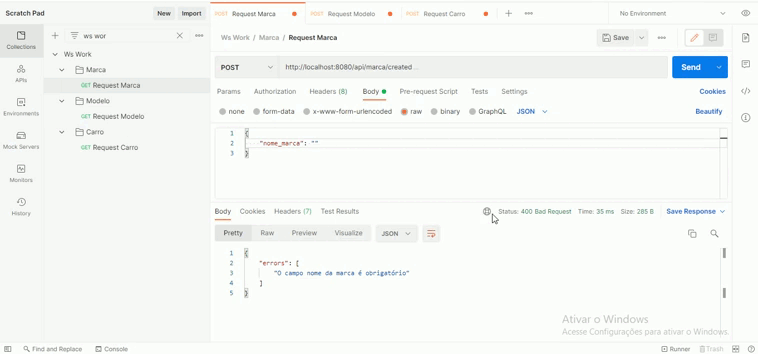

<h2 align="center"></h2>

---

<h1 align="center">🚀 Teste - Ws Work </h1>

<h2 align="center">👁‍🗨👁‍🗨</h2>
<h3 align="center">✅ Teste pelo Localhost 8080 usando o Postman</h3>
<p>
<h1 align="center"></h1>

<h3 align="center">✅ Teste depois de fazer o deploy no heroku</h3>
<p>
<h1 align="center"></h1>

## **`Sobre`**

 Aplicação Api Rest criado com Spring-boot, banco de dados H2 e postgreSQL.

* Operações
    * Get
    * Post
    * Update
    * Delete

Utilizando o projeto localmente no endereço http://localhost:8080 podera usar o banco de teste H2. 

---
<h2 align="center">Implantação do sistema na nuvem através do Heroku.</h3>

O deploy desse sistema foi feito no Heroku com banco de dados postgreSQL. 

* URL
    * Get - https://wswork-cars.herokuapp.com/api/carro

---

```
# clonar repositório
git clone https://github.com/AAndersonSantos/API-SpringBoot.git
```
## **`Tecnologias utilizadas`**

* Java 11
* Spring Tool Suite 4
* Spring Boot
* JPA / Hibernate
* Maven

<h2 align="center">A estrutura que foi criada</h2>

```
.
└───application
    │      RestApiWsworkApplication.java
    │
    ├───config
    │       ValidatorConfig.java
    │
    ├───controller
    │       CarroController.java
    │       MarcaController.java
    │       ModeloController.java
    │
    ├───controllerAdvice
    │   │   ControllerAdvice.java
    │   │
    │   └───exception
    │           ApiErrors.java
    │
    ├───dto
    │       CarroDto.java
    │
    ├───model
    │       Carro.java
    │       Marca.java
    │       Modelo.java
    │
    ├───repository
    │       CarroRepository.java
    │       MarcaRepository.java
    │       ModeloRepository.java
    │
    └───service
            CarroService.java
            MarcaService.java
            ModeloService.java
```
---

<h2 align="center">Modelo conceitual banco de dados</h2>

<h3 align="center"></h3>

<h3 align="center">Criado por🤖Anderson Santos</h3>


